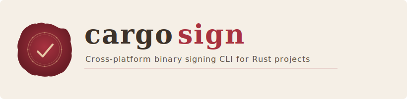

<p align="center">
  
</p>

<p align="center">
  <a href="https://crates.io/crates/cargo-codesign"></a>
  <a href="https://github.com/steganogram/cargo-codesign/blob/main/LICENSE-MIT"></a>
</p>

---

A cargo subcommand that handles code signing, notarization, and update signatures for Rust binaries across macOS, Windows, and Linux.

## Quick start

```sh
cargo install cargo-codesign
cargo codesign init          # generate sign.toml
cargo codesign status        # check credentials and tools
cargo codesign macos --app target/release/bundle/MyApp.app
```

## Documentation

Full documentation is available in the [cargo-codesign book](https://steganogram.github.io/cargo-codesign/) (coming soon).

## License

Licensed under either of [Apache License, Version 2.0](LICENSE-APACHE) or [MIT License](LICENSE-MIT) at your option.
